# Drupal Canvas
### Advanced Site Building


---

## Ted Bowman

- Acquia: Drupal Applications Team
- @tedbow Drupal.org
- Previous: Layout Builder, REST, Settings Tray(🫢)
- Back-end Developer
- Site Builder?


---

## What is Drupal Canvas?

- Visual First!
- Page Builder
- In-browser code component creator
- Page Building AI assistant
- Vibe Coding Code component assistant
- Content Templater

---

## Page Builder

- Pages: New Canvas content entity type
- Not fieldable
- Build without further configuration
- Needs a Canvas compatible theme

---

## Code Component Creator

- Live code editor with syntax highlighting for JavaScript/JSX
- Real-time preview pane to see changes as you code
- Support for modern React/Preact patterns and syntax
- Javascript\CSS Component

---

## Code Component Creator

- Uses props to make components configurable and reusable
- Uses slots for nested components
- Work alongside standard Drupal blocks and SDC components
- Uses JSON:API to fetch site content

---

## Content Templating

- Design the look of content type pages
- Replaces pagese,"Manage Display"
- Connect to data after
- Only Node Full view for now

---
<!-- ## SDC section start -->

# SDC: Single Directory Components
- Stored in, wait for it...... a single directory!
- Drupal Core sub-system for reusable components
- Needs: .component.yml + .twig files
- Can have: .js, .css, asset files

---

## SDC: Canvas Use Case
- Props: Input Values provided in UI
- Slots: Drop zones to nest other components
  - SDC, Code Component, Block, others

---

## SDC: Canvas Use Case

<div style="display: flex; gap: 2rem; align-items: center;">
  <ul>
    <li>Props and Slot not necessity</li>
    <li>Example SDC displaying:
      <ul>
        <li>Company logo</li>
        <li>Picture of Capybara</li>
      </ul>
    </li>
  </ul>
  
</div>

---

### Example SDC: Number
- prop type: number
- displays the prop

---
## Files
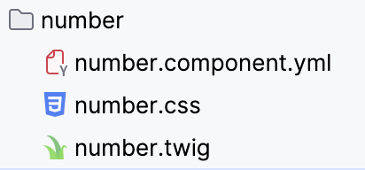

---

### number.component.yml
```yaml

name: Number
status: stable
props:
  type: object
  properties:
    number:
      type: number
      title: Number
      description: The number to display
      examples:
        - 42
```

---

### number.twig
```twig
<span class="number">{{ number }}</span>
```

### number.css
```css
.number {
  font-variant-numeric: tabular-nums;
}

```

<!-- ## SDC section end -->

---

## Demo Site

- Using TV Maze API
  - Shows
  - Episodes
  - Cast

---

## Data Model

<svg width="750" height="450" style="margin: 0 auto; display: block;">
  <rect x="275" y="300" width="200" height="80" fill="#1e40af" stroke="#fff" stroke-width="2"/>
  <text x="375" y="350" text-anchor="middle" fill="#fff" font-size="22" font-weight="bold">Network</text>
  <rect x="275" y="120" width="200" height="80" fill="#1e40af" stroke="#fff" stroke-width="2"/>
  <text x="375" y="170" text-anchor="middle" fill="#fff" font-size="28" font-weight="bold">Show</text>
  <rect x="40" y="20" width="160" height="80" fill="#1e40af" stroke="#fff" stroke-width="2"/>
  <text x="120" y="70" text-anchor="middle" fill="#fff" font-size="20" font-weight="bold">Episodes</text>
  <rect x="550" y="20" width="160" height="80" fill="#1e40af" stroke="#fff" stroke-width="2"/>
  <text x="630" y="70" text-anchor="middle" fill="#fff" font-size="20" font-weight="bold">Cast</text>
  <line x1="120" y1="100" x2="320" y2="120" stroke="#fff" stroke-width="2"/>
  <polygon points="320,120 310,117 315,127" fill="#fff"/>
  <line x1="630" y1="100" x2="430" y2="120" stroke="#fff" stroke-width="2"/>
  <polygon points="430,120 435,127 430,117" fill="#fff"/>
  <line x1="375" y1="200" x2="375" y2="300" stroke="#fff" stroke-width="2"/>
  <polygon points="375,300 370,290 380,290" fill="#fff"/>
</svg>

---

### Creating a homepage

<video controls style="max-height: 85vh; max-width: 100%;" >
  <source src="videos/homepage_start.mov" type="video/mp4" >
</video>

---

### Adding a View

<video controls style="max-height: 85vh; max-width: 100%;">
  <source src="videos/homepage_views_trimmed.mov" type="video/mp4">
</video>

---

### Basic View Displaying Teasers

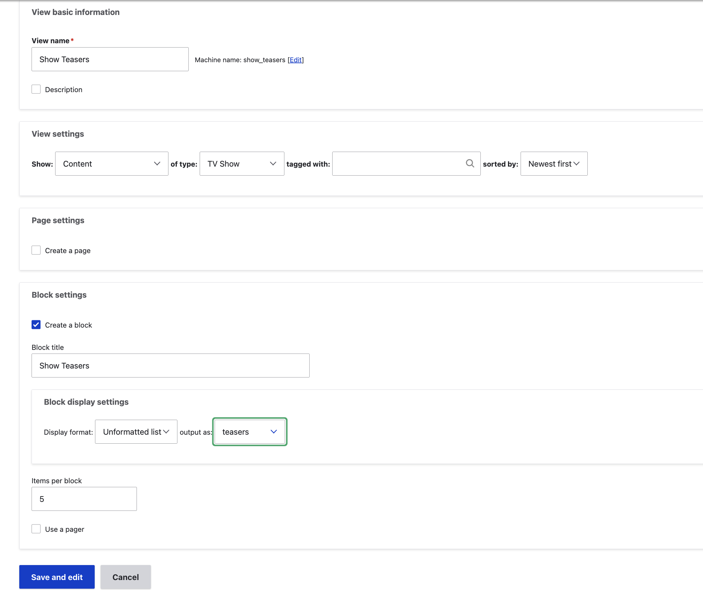

---

### Old Fashion: Show Teaser

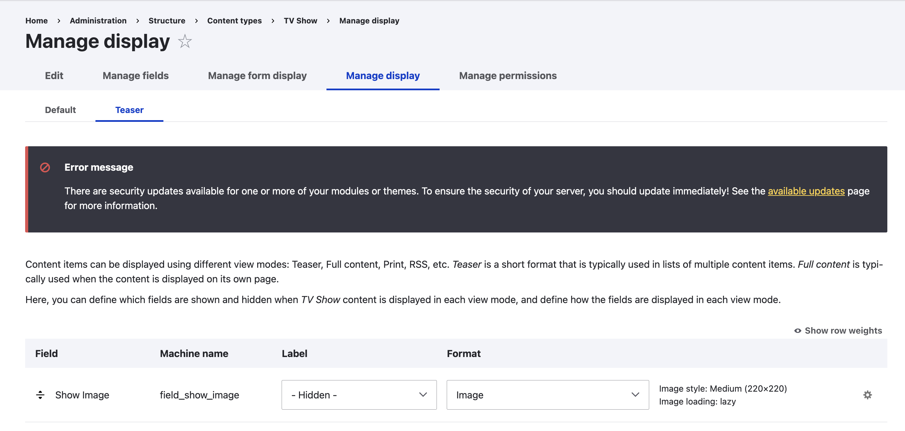

---

<div style="display: flex; flex-direction: column; height: 45vh; justify-content: space-between;">
  <h2>😢Not Great</h2>
  <h2>But we will fix with Canvas soon!⏱️</h2>
</div>

---

# Content Templates

---

## Content Types


---

### Core: Manage Display

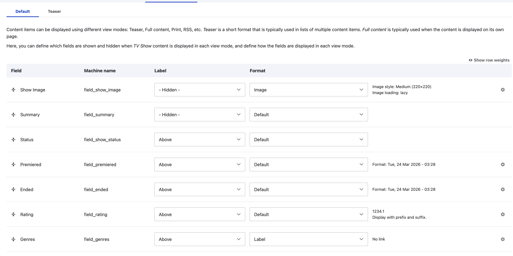

---

### Core: Manage Display

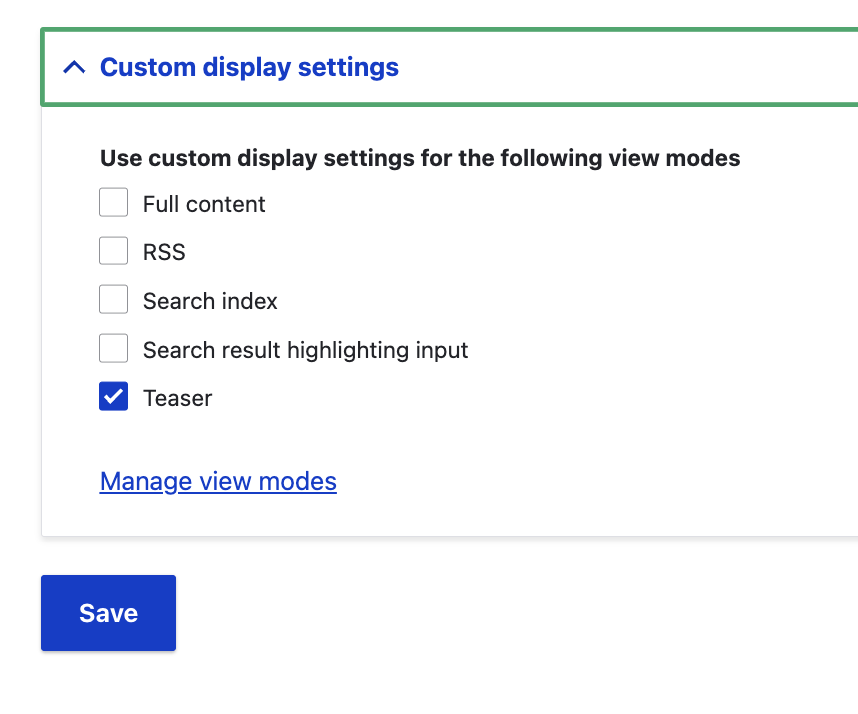
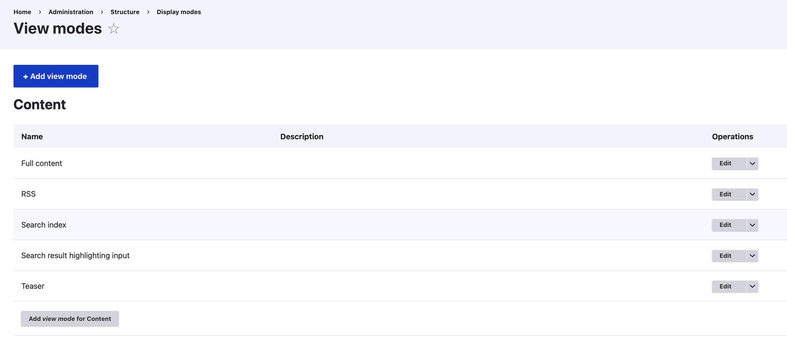

---

### Core: View Modes


---

## Canvas Templates

- Override View Modes
- Full, Teaser, etc

---

### TV Show: Full View


---
### Creating a TV Show Template
<video controls style="max-height: 85vh; max-width: 100%;">
  <source src="videos/template_show_start_1.mov" type="video/mp4">
</video>

---

### Linking Props to Fields

<div style="display: flex; gap: 2rem; align-items: center; justify-content: center;">
  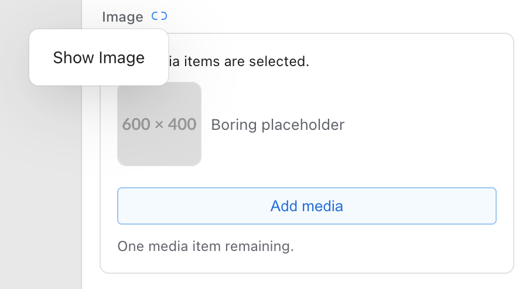
  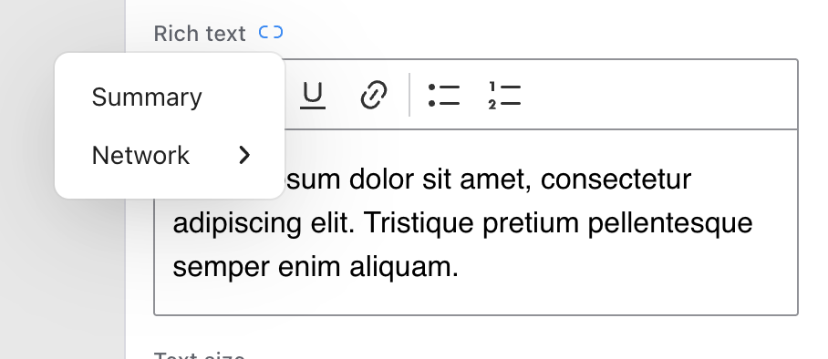
</div>

### Must match prop type to field type

---

### TV Show: Fields

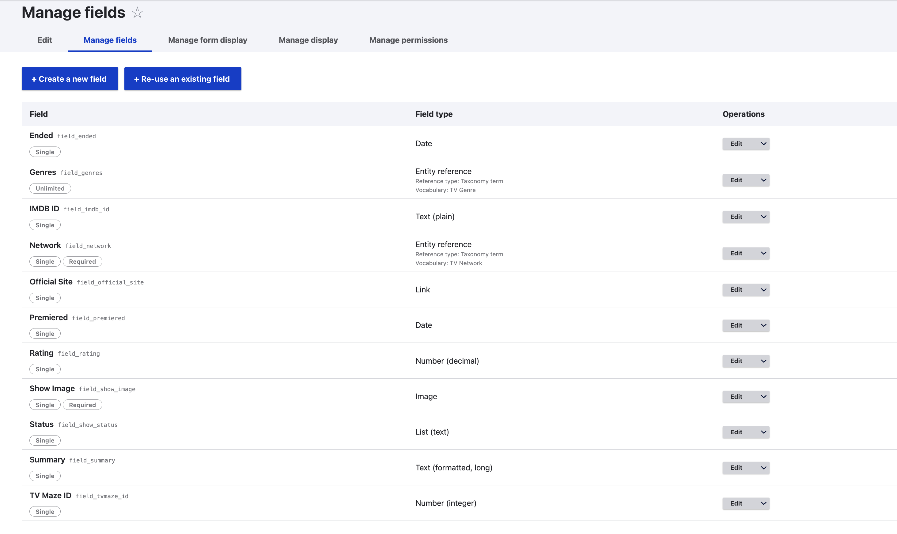

---

### TV Show: Fields

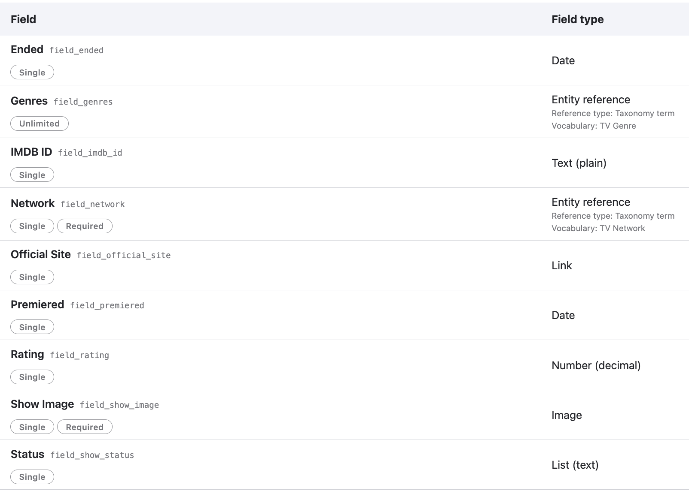

---

### Show Template: More Components

<video controls style="max-height: 85vh; max-width: 100%;">
  <source src="videos/tempate_button_date_network.mp4" type="video/mp4">
</video>

---

### Publishing the Template

<video controls style="max-height: 85vh; max-width: 100%;">
  <source src="videos/publish_template.mov" type="video/mp4">
</video>

---

## Fixing the Home Page!

### Teasers, Patterns, oh my!

---

## Adding a Teaser View Mode

<video controls style="max-height: 85vh; max-width: 100%;">
  <source src="videos/fix_home_page1.mov" type="video/mp4">
</video>  

---

# What the?

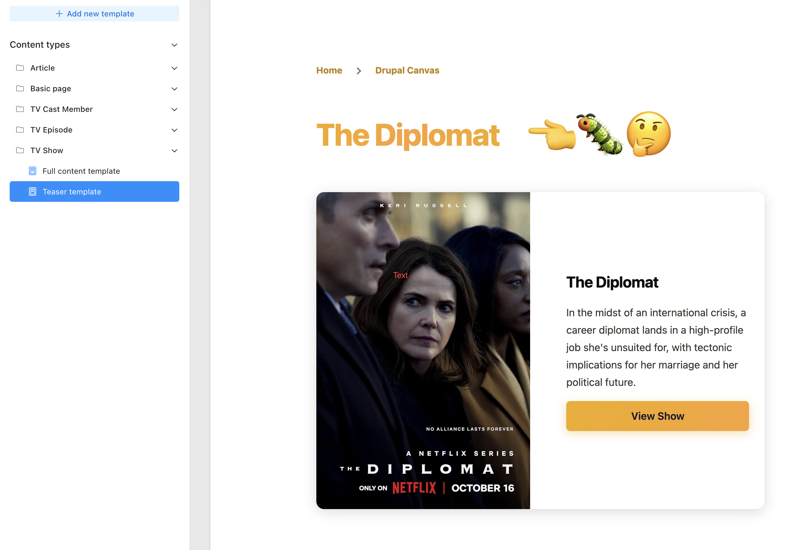

---

## Our site so far...

<video controls style="max-height: 85vh; max-width: 100%;">
  <source src="videos/progress2.mov" type="video/mp4">
</video>  

---

## Episode Templates, you got this!

<video controls style="max-height: 85vh; max-width: 100%;"  onloadedmetadata="this.playbackRate = 16;" style="max-height: 85vh; max-width: 100%;">
  <source src="videos/making_episode_templates_trimeed.mov" type="video/mp4" >
</video>

___
# Thanks!
